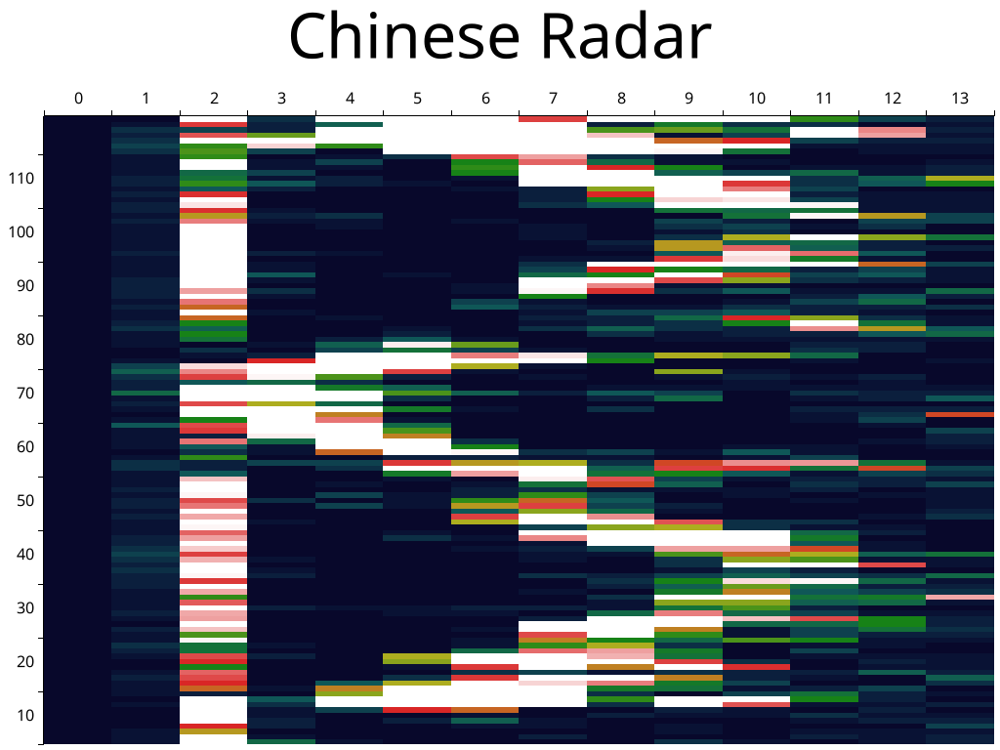

# LD2412 and LD2450 driver made in Rust

## Description
This is a Rust library for the LD2412 and LD2450 radar modules.

Other modules can be easily added, as the protocol is somewhat similar.

The library is no_std and ready to be used in embedded systems.

## Examples

`RUST_LOG=trace cargo run --bin main`

Example output from LD2450

```
[2025-03-23T11:47:48Z INFO  main] Ld2450TargetData {
        targets: [
            TargetData {
                position: Position {
                    x: -69,
                    y: 380,
                },
                speed: 8,
                distance_resolution: 360,
            },
        ],
    }
```

Example plot of LD2412 engineering data output (made with external software):

